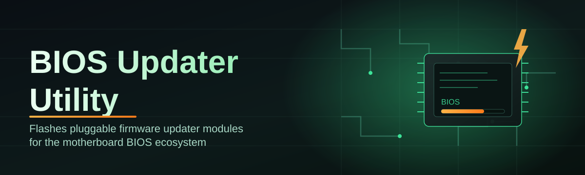

# bios-updater-utility 🔧⚡

  

*Your motherboard's firmware, kept current, without the guesswork.*

  

## 🧭 Overview

Firmware is the part of a PC that everyone forgets exists — until a missing microcode patch, a broken memory training routine, or an unsupported CPU generation forces you to think about it. **bios-updater-utility** exists to make that moment painless. It is a standalone Windows utility that detects your motherboard, cross-references known-good firmware revisions, and walks you through a safe, verified BIOS/UEFI update from a single window — no manual, no forum archaeology, no guessing which `.CAP` or `.ROM` file actually belongs to your board revision.

The BIOS updater space has historically been fragmented: every motherboard vendor ships its own flashing tool, with its own quirks, its own naming conventions, and its own tolerance for user error. This project takes a vendor-agnostic approach instead. It reads the same SMBIOS and ACPI tables the operating system already relies on, builds a fingerprint of your hardware, and matches that fingerprint against a structured revision catalog before ever touching your firmware chip. The result is a single, consistent update experience regardless of whether your board came from a boutique OEM or a mainstream desktop brand.

This tool is built for builders, system integrators, IT technicians managing fleets of desktops, and enthusiasts who just want their BIOS version to stop nagging them. If you've ever hesitated before flashing firmware because "what if it bricks the board" — that hesitation is exactly the problem this utility is designed to remove.

  

---

## 🔥 What It Actually Does

> [!NOTE]
> Every capability below runs locally on your machine. No firmware images are uploaded anywhere — only version metadata is checked against the catalog.

- **Board Fingerprinting** — reads SMBIOS, DMI, and ACPI tables to identify your exact motherboard model and revision, eliminating the "which BIOS file do I even need" problem.

- **Revision Diffing** — compares your currently installed firmware version against the latest cataloged release and shows you exactly what changed: microcode, memory compatibility, security patches, or feature additions.

- **Guided Flash Wizard** — a linear, step-by-step flow that confirms hardware match, power state, and battery/UPS presence before allowing the flash to proceed.

- **Pre-Flight Safety Checks** — validates that your system is on AC power (for laptops), that no pending Windows Update reboot is queued, and that available disk space and checksum integrity are all in order.

- **Rollback Snapshot Notes** — records your pre-update firmware version and settings profile so you have a clear reference point if you ever need to revert manually via your board's built-in flashback feature.

- **Offline Catalog Mode** — cache firmware metadata locally so technicians working in air-gapped or bandwidth-limited environments can still verify version status.

- **Batch-Friendly Reporting** — exports a plain-text or CSV summary of detected hardware and firmware status, useful for IT teams auditing dozens of machines.

- **Silent/Unattended Flags** — command-line switches for scripted deployment across managed fleets without manual clicks per machine.

> [!TIP]
> Run the utility once with the `--report-only` flag on a new machine before doing anything else. It costs nothing and tells you exactly where you stand.

---

## 🚀 How to Get Started

1. **Visit the landing page** using the download button above — this is the only distribution point for the tool.

2. **Download the executable** — it's a single portable binary, no installer wizard, no bundled extras.

3. **Run it as Administrator** — firmware access on Windows requires elevated privileges; right-click → *Run as administrator*.

4. **Follow the on-screen wizard** — the utility detects your board, shows the available revision, and walks you through the flash step by step.

> [!IMPORTANT]
> Never interrupt a firmware flash once it has started — no reboot, no power disconnect, no sleep/hibernate. Interrupting a write cycle is the single most common cause of a bricked board.

---

## 🖥️ System Requirements

| Requirement | Detail |
|---|---|
| **OS** | Windows 10 (21H2+) or Windows 11, 64-bit |
| **Privileges** | Administrator rights required for firmware access |
| **Dependencies** | None — fully standalone, no runtime installs needed |
| **Disk Space** | ~150 MB free for cached firmware metadata and logs |
| **Power** | AC power connection strongly recommended for laptops |
| **Architecture** | x86_64 desktop and laptop motherboards |

  

---

## ⚙️ How It Works

The utility follows a deliberately linear pipeline — every step must succeed before the next one is unlocked, which keeps firmware operations predictable and auditable.

1. **Detect** — reads SMBIOS/DMI tables to identify motherboard vendor, model, and current firmware revision.

2. **Match** — cross-references your fingerprint against the firmware revision catalog to find the correct available update.

3. **Validate** — runs pre-flight checks: power state, disk space, checksum integrity of the downloaded firmware image.

4. **Flash** — writes the verified firmware image to the BIOS/UEFI chip using the safest write path supported by your board.

5. **Confirm** — reboots and re-reads firmware version to confirm the update landed correctly.

<strong>Why the pipeline is this rigid on purpose</strong>

 

Firmware flashing has zero tolerance for shortcuts. Skipping a validation step to "save time" is exactly how boards end up bricked. The linear, gated design means each stage acts as a checkpoint — if detection is ambiguous or a checksum doesn't match, the utility halts before anything touches the flash chip.

---

## 🩹 Troubleshooting

**Q: The utility says it can't identify my motherboard — what now?**
A: This usually happens on heavily customized OEM boards with stripped SMBIOS tables. Use `--manual-select` to pick your board model from the catalog directly.

**Q: My laptop won't let me start the flash process.**
A: Battery-powered flashing is blocked by design. Plug into AC power — this is a safety gate, not a bug.

**Q: The update finished but Windows still shows the old BIOS version.**
A: Some boards require a full cold shutdown (not just a reboot) for the new firmware to register. Power off completely, wait 10 seconds, power back on.

**Q: Can I downgrade to an older firmware revision?**
A: Yes, via `--allow-downgrade`, but only revisions still present in the catalog are permitted — this prevents flashing unverified or unsupported images.

**Q: The checksum validation keeps failing.**
A: Almost always a network interruption during metadata sync. Clear the local cache with `--clear-cache` and re-run the wizard.

**Q: Is it safe to run this on a system with a dual-BIOS or BIOS flashback header?**
A: Yes — the utility detects dual-BIOS configurations and will tell you which chip is currently active before flashing.

---

## 🎨 UI / UX Details

The interface is intentionally minimal — firmware tools are not the place for visual flourish.

- **Themes**: Light, Dark, and System (follows Windows theme automatically).

- **Keyboard Shortcuts**:

| Shortcut | Action |
|---|---|
| `Ctrl + R` | Re-scan hardware |
| `Ctrl + L` | Open log viewer |
| `Ctrl + Enter` | Confirm and proceed to next wizard step |
| `Esc` | Cancel current step (disabled once a flash is active) |
| `F5` | Refresh firmware catalog |

- **Settings persistence**: preferences (theme, catalog cache location, report export path) are stored in a local config file next to the executable — nothing is written to the registry.

> [!WARNING]
> The `Esc` cancel shortcut is intentionally disabled the moment a flash write begins. This is not a UI bug — it prevents accidental interruption mid-write.

---

## 🤝 Contributing & Community

Contributions, bug reports, and board-compatibility notes are welcome. If your motherboard model isn't in the catalog yet, opening an issue with your exact board revision helps everyone who owns the same hardware.

- Open an **Issue** for bugs, unsupported boards, or catalog corrections.

- Open a **Discussion** for general questions or update strategy advice.

- Submit a **Pull Request** for catalog additions, translations, or documentation fixes.

> [!TIP]
> When reporting a hardware detection issue, attach the output of `--report-only` — it saves several rounds of back-and-forth.

---

## 📄 License

Released under the [MIT License](LICENSE), 2026.

---

## ⚠️ Disclaimer

Firmware updates carry inherent risk, including the possibility of an unbootable system if interrupted or applied to incompatible hardware. **bios-updater-utility** performs extensive validation to minimize this risk, but no software can guarantee against power loss, hardware faults, or manufacturer-side firmware defects. Use at your own discretion, always ensure a stable power source, and consult your motherboard manufacturer's documentation for board-specific flashing guidance.

  

